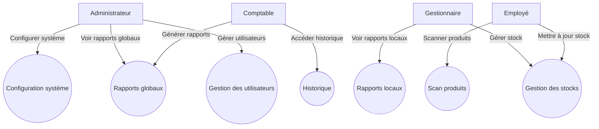
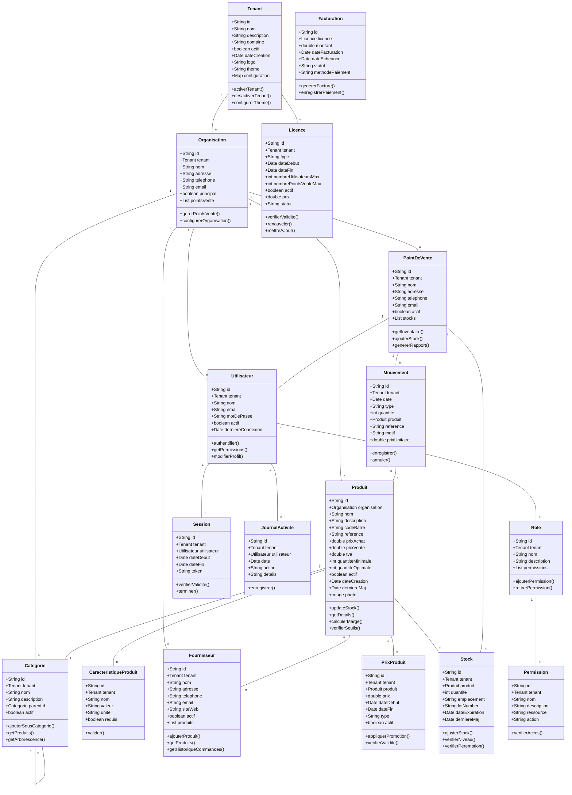
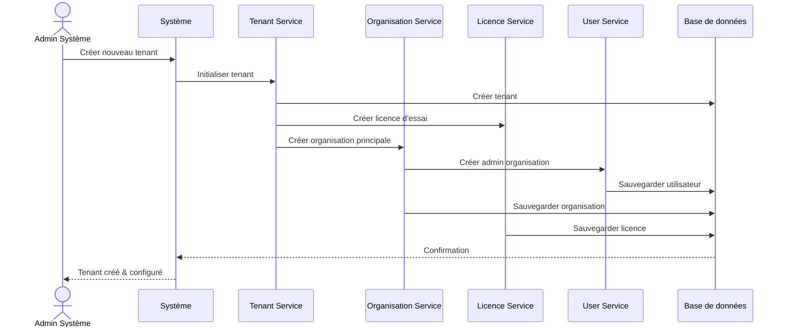
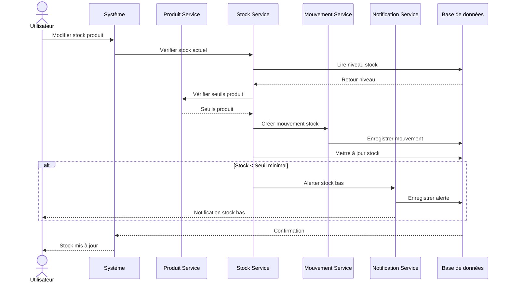
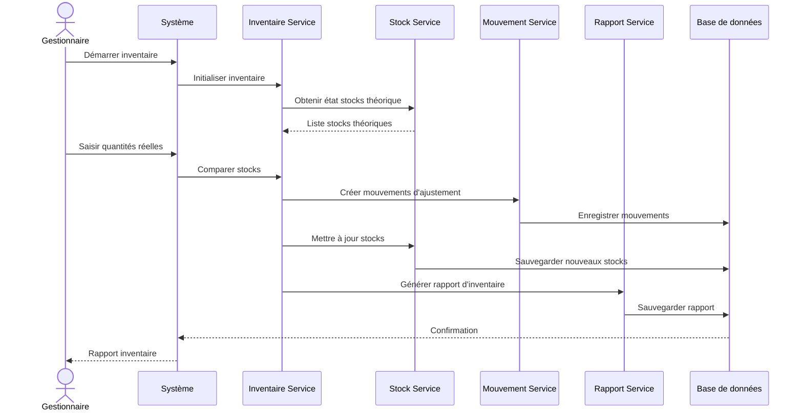
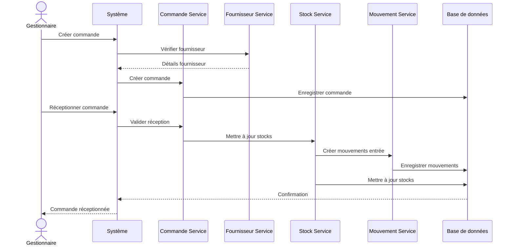
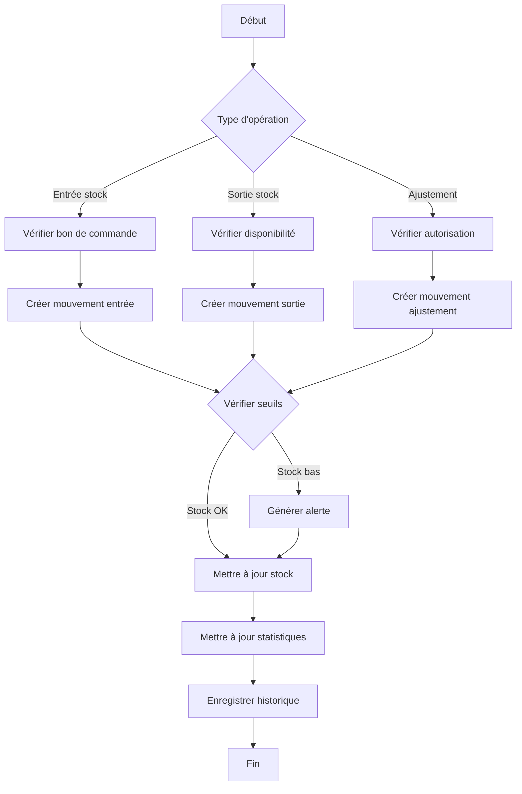
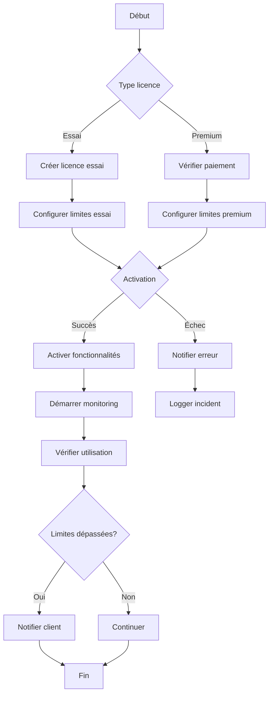
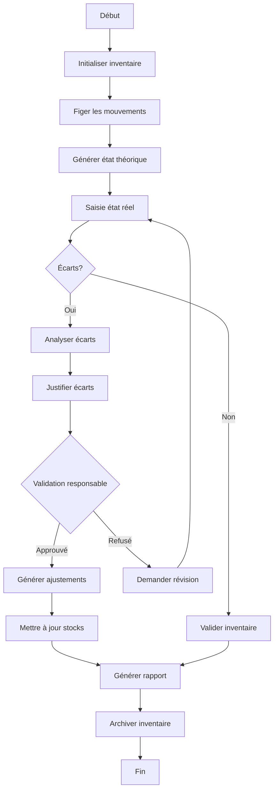
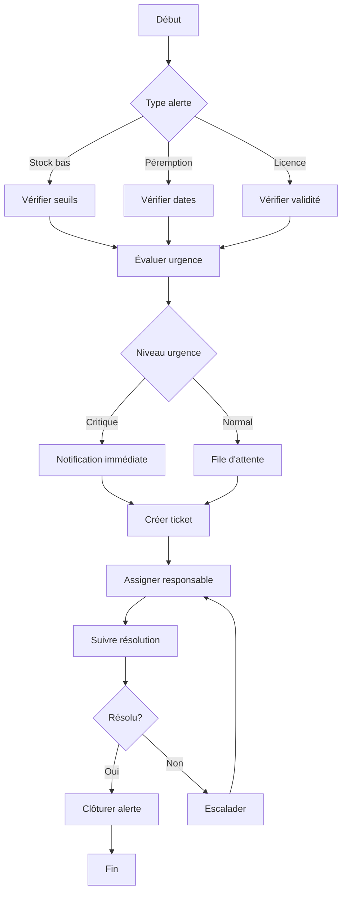

# Spécification des Exigences Logicielles (SRS)
# Système de Gestion d'Inventaire en Temps Réel

## Table des matières
1. [Introduction](#introduction)
   - 1.1 [Objectif](#objectif)
   - 1.2 [Portée du projet](#portée-du-projet)
   - 1.3 [Définitions et acronymes](#définitions-et-acronymes)
2. [Description générale](#description-générale)
   - 2.1 [Perspective du produit](#perspective-du-produit)
   - 2.2 [Fonctionnalités du produit](#fonctionnalités-du-produit)
   - 2.3 [Caractéristiques des utilisateurs](#caractéristiques-des-utilisateurs)
3. [Diagrammes du système](#diagrammes-du-système)
   - 3.1 [Diagramme de cas d'utilisation](#diagramme-de-cas-dutilisation)
   - 3.2 [Diagramme de classe](#diagramme-de-classe)
   - 3.3 [Diagrammes de séquence](#diagrammes-de-séquence)
   - 3.4 [Diagramme de flux](#diagramme-de-flux)
4. [Exigences spécifiques](#exigences-spécifiques)
   - 4.1 [Exigences fonctionnelles](#exigences-fonctionnelles)
   - 4.2 [Exigences non fonctionnelles](#exigences-non-fonctionnelles)
5. [Interfaces externes](#interfaces-externes)
   - 5.1 [Interfaces utilisateur](#interfaces-utilisateur)
   - 5.2 [Interfaces logicielles](#interfaces-logicielles)

## 1. Introduction

### 1.1 Objectif
Ce document présente les spécifications détaillées pour un système de gestion d'inventaire en temps réel. Le système est conçu pour permettre une gestion efficace des stocks dans un ou plusieurs points de vente, avec un accent particulier sur le suivi en temps réel et la génération rapide d'inventaires.

### 1.2 Portée du projet
Le système couvre :
- Gestion des stocks en temps réel
- Suivi des inventaires multi-sites
- Génération de rapports d'inventaire
- Gestion des alertes de stock
- Interface d'administration centralisée

### 1.3 Définitions et acronymes
- **SKU** : Stock Keeping Unit
- **POS** : Point of Sale (Point de vente)
- **RT** : Real Time (Temps réel)
- **WMS** : Warehouse Management System

## 2. Description générale

### 2.1 Perspective du produit
Le système de gestion d'inventaire est une application autonome qui peut être intégrée avec d'autres systèmes de gestion d'entreprise. Il est conçu pour fonctionner dans le cloud, permettant un accès depuis plusieurs points de vente.

### 2.2 Fonctionnalités du produit
- Suivi en temps réel des stocks
- Gestion multi-magasins
- Génération de rapports d'inventaire
- Alertes de stock bas
- Historique des mouvements
- Dashboard administrateur
- Gestion des utilisateurs et des rôles

### 2.3 Caractéristiques des utilisateurs
- **Administrateur système** : Gestion complète du système
- **Gestionnaire de magasin** : Gestion des stocks d'un point de vente
- **Employé** : Consultation et mise à jour des stocks
- **Comptable** : Accès aux rapports et à l'historique

## 3. Diagrammes du système

### 3.1 Diagramme de cas d'utilisation

### 3.2 Diagramme de classe

### 3.3 Diagrammes de séquence

#### 3.3.1 Création et Configuration d'un Nouveau Tenant

#### 3.3.2 Gestion des Stocks et Inventaire

#### 3.3.3 Processus d'Inventaire

#### 3.3.4 Gestion des Commandes et Approvisionnement

### 3.4 Diagrammes de flux

#### 3.4.1 Flux de Gestion des Stocks

#### 3.4.2 Flux de Gestion des Licences

#### 3.4.3 Flux d'Inventaire

#### 3.4.4 Flux de Traitement des Alertes

## 4. Exigences spécifiques

### 4.1 Exigences fonctionnelles
1. **Gestion des stocks**
   - Suivi en temps réel des quantités
   - Alertes de stock bas automatiques
   - Historique des mouvements
   - Génération de rapports

2. **Gestion des utilisateurs**
   - Création et gestion des comptes
   - Attribution des rôles
   - Gestion des permissions
   - Historique des actions

3. **Rapports et analyses**
   - Rapports d'inventaire en temps réel
   - Analyses des tendances
   - Exportation des données
   - Tableaux de bord personnalisables

### 4.2 Exigences non fonctionnelles
1. **Performance**
   - Temps de réponse < 2 secondes
   - Disponibilité 99.9%
   - Support de 1000 utilisateurs simultanés

2. **Sécurité**
   - Authentification à deux facteurs
   - Chiffrement des données
   - Journalisation des actions
   - Sauvegarde quotidienne

3. **Utilisabilité**
   - Interface intuitive
   - Formation minimale requise
   - Support mobile
   - Documentation complète

## 5. Interfaces externes

### 5.1 Interfaces utilisateur
- Interface web responsive
- Application mobile native
- Terminal de point de vente
- Dashboard administrateur

### 5.2 Interfaces logicielles
- API REST pour l'intégration
- Connecteurs pour systèmes ERP
- Interface pour systèmes de paiement
- Export vers formats standards (CSV, Excel) 